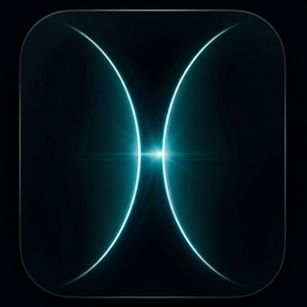
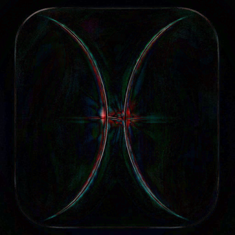

# icon-vector-reconstruction

A resolution-independent reconstruction of `reference.png` — a 1024x1024 dark
icon showing two luminous cyan curves pinched around a central light inside a
rounded-square frame — as a hand-built, parametric SVG.

| reference | reconstruction | difference (x4) |
|---|---|---|
|  |  |  |

**Primary deliverable: [`reconstruction.svg`](reconstruction.svg)** — 28 named
layers, ~68 KB, no embedded bitmap and no traced outlines. Every mark is a
primitive driven by a named parameter in
[`src/params.json`](src/params.json): one path for the frame, two cubic-Bézier
paths for the luminous curves (reused, offset and clipped, by every glow
layer), and blurred ellipses, rects, cones and gradients for the optical
effects.

<!-- METRICS:START -->
## Fidelity

Reconstruction rendered at 1024 px (resvg) against `reference.png`:

| metric | value | for scale |
|---|---|---|
| mean absolute error | **1.941** / 255 | a flat black canvas scores 17.89 |
| RMSE | 4.075 | |
| MAE on a 1/2.2 display curve | 5.766 | weights the dark background as the eye does; black scores 59.7 |
| SSIM (luminance) | **0.9731** | black scores 0.142 |
| worst single-channel error | 105 | |
| pixels off by more than 2 / 8 / 24 | 35.7% / 5.5% / 0.7% | |
| mean bias | -0.306 | |

Per region (MAE): frame band 2.55, centre 90 px 7.60, bright pixels 10.02, dark background 1.45, everything else 1.72.

About a quarter of that error is the reference's own JPEG noise: decomposed by
scale, the background residual implies an MAE floor of 0.57-0.61 per channel
that no reconstruction of the underlying design can go below.

The two regions a whole-image average cannot police, from
`tools/diagnose.py` (full report in `out/diagnostics.json`):

| targeted measurement | value |
|---|---|
| MAE within 110 px of the central light | 6.37 |
| worst ring of the flare's radial profile | +5.5 code values at r = 6-12 |
| curve glow, rms relative error over 21 signed-distance bins | 4.1% |
| the same, resolved along the curve (71 cells) | 5.2% |
| light in the four interior corners, rms relative error | 5.6% |
| worst single bin of that profile | -11.7% at s = 9..14 px |
| left lobe, MAE more than 25 px from the ridge | 1.47 (bias -0.06) |
| right lobe, MAE more than 25 px from the ridge | 1.37 (bias -0.21) |

Cross-engine: the same SVG in resvg and headless Chromium agrees to MAE 2.909 (SSIM 0.9499); see `out/validation.md` for the resolution sweep.
<!-- METRICS:END -->

## What is in here

```
reference.png            the ground truth (unmodified)
reconstruction.svg       the deliverable, generated from src/
src/params.json          every number that defines the artwork
src/build_svg.py         params -> SVG (geometry, gradients, filters, layer stack)
tools/render.py          SVG -> PNG at any size, via resvg or headless Chromium
tools/compare.py         metrics + difference images against the reference
tools/probe_compare.py   geometric probes: measure reference and render the same way
tools/fit_photometry.py  closed-form fit of every layer's light amount
tools/optimize.py        bounded coordinate descent over shapes/tapers/geometry
tools/optimize_all.sh    the full fitting cycle
tools/prune_layers.py    re-fits without each layer to see which ones earn their place
tools/isolate.py         recovers one layer group's own contribution from the reference
tools/diagnose.py        targeted reports for the flare, the lobes and the glow profile
tools/regions.py         the measured anchors and region geometry both of those share
tools/test_pipeline.py   regression checks that keep optimisation results meaningful
tools/validate.py        multi-resolution and cross-engine validation report
tools/update_readme.py   writes the measured metrics back into this file
docs/METHOD.md           what the image is made of, and how it is reproduced
docs/DECISIONS.md        decision record: what was chosen, why, what was rejected
docs/stage1_findings.md  the first-pass measurements the rest was built on
out/analysis/            per-component measurement reports
out/diagnostics.json     the targeted flare / profile / corner measurements
out/prune.log            what each layer is worth, as MAE
out/                     renders, difference images, metrics, validation report
```

## Reproducing

Needs Python 3 with `numpy`, `Pillow` and `resvg-py` (`pip install numpy pillow
resvg-py`). Headless Chromium is optional and only used for the second opinion
in `tools/validate.py`.

```sh
python3 src/build_svg.py                                    # params -> reconstruction.svg
python3 tools/render.py reconstruction.svg out/r.png --size 1024
python3 tools/compare.py reference.png out/r.png --out-prefix out/diff
python3 tools/validate.py                                   # sizes 256..4096, both engines
python3 tools/validate.py --quick --no-chromium              # resvg only, no browser needed
python3 tools/probe_compare.py out/r.png                     # geometry/alignment probes
python3 tools/diagnose.py out/r.png                          # flare / lobe / profile reports
python3 tools/test_pipeline.py                               # optimiser correctness checks
sh tools/optimize_all.sh                                     # refit everything from scratch
```

`tools/compare.py` writes `out/diff_diff.png` (absolute difference, x4 gain),
`out/diff_signed.png` (red = reconstruction too bright, blue = too dark) and
`out/diff_sbs.png` (side by side).

## How it works, in one page

The reference decomposes into geometry plus smooth optical falloffs, so the SVG
is a stack of primitives composited with `mix-blend-mode: screen` over black:

1. **Background** — flat exterior, then the frame shape filled with a base
   colour plus two broad radial gradients.
2. **Glow** — three blurred copies of each curve's path, offset inward by the
   measured 3.3 / 16.2 / 62.1 px so their profiles are Gaussians of sigma
   7.2 / 26.9 / 56.6 px; the offsets are what make the glow 2.8-3.5x brighter
   on the concave side. Each carries its own measured fade along the curve.
3. **Central light** — two horizontally stretched blooms, a thin horizontal
   streak (sigma 2.2 px across, e-folding 30 px along), three one-sided
   diagonal rays, and a separate compact glint just inside the right curve's
   apex, which is where the icon's actual brightest pixels are.
4. **Curve cores** — a hard-edged bright stroke on each path plus a narrower
   inset one, because the measured core is 5.8 px at the tips, 8.4 px at
   mid-height, and asymmetric about its own centre-line.
5. **Rim** — one uniform stroke plus four edge-highlight strokes, because the
   measured rim brightness peaks at the middle of each edge and the top edge is
   twice as bright as the bottom.

Three measurements did most of the work:

* **The curves are not conics.** Two cubic Beziers joined at the apex with a
  vertical tangent fit the ridge to 0.083/0.093 px; the best ellipse arc manages
  0.331/0.473 px and leaves a systematic 4-5 lobe residual.
* **The frame corners are continuous-curvature corners**, three arcs each
  (blend r 639, main r 163.56, blend r 639): the local radius of curvature runs
  250-400 px near the straight edges and 145-175 px through the 45-degree
  region, and a circle fitted to the corner points cannot even be tangent to
  the measured straight edges.
* **All the light lies in a narrow non-negative colour cone** — white(1, 1, 1),
  cyan(0, 0.94, 1.00) and blue(0, 0, 1) — so each layer carries three
  non-negative amounts rather than three free channels, and the cone's
  `R <= G <= B` is a constraint the fit cannot escape by inventing a green or
  magenta layer. All three are needed: over the 946 964 reference pixels above
  luminance 3, the non-negative fit in this basis is off by 0.010/255, while
  dropping blue and using white+cyan alone is off by 1.84/255. The reason is the
  dark field, which is not cyan: across its 620 317 pixels between luminance 3
  and 14 the mean colour is (1.8, 7.1, 13.4), G/B = 0.53 against cyan's 0.94.

Because everything is screen-composited, the render has the closed form
`out = 1 - prod(1 - A_i k_i)`, so each layer's colour can be fitted analytically
from a single white render of that layer. That is why the fitting loop is fast
enough to search the geometry.

## Known limitations

* The reference's JPEG blocking and its low-frequency "smudge" texture are not
  reproduced, by choice: together they set an MAE floor of ~0.6 per channel.
* The two dark axial wedges between the diverging curves used to be
  over-predicted by ~4 code values, and this list blamed the additive stack for
  it: "a screen stack can only add light". That was the wrong diagnosis. The
  wedges are dark because nothing in the reference puts light there, and the
  over-prediction was two model errors — a broad glow that was not one-sided
  and a central bloom with more than twice its measured reach — both fixed in
  `docs/DECISIONS.md` D13 and D14. Their mean bias is now -0.15 code values
  (MAE 1.33 against a JPEG noise floor of ~0.6), i.e. slightly *under*-lit
  rather than over-lit.
* **The same SVG is about 2.8 code values brighter in Chromium than in resvg.**
  Chromium composites each dim screen layer 0.26-0.33 counts brighter, and with
  29 layers that accumulates to a near-uniform lift of the dark background;
  removing the mean offset leaves the two engines agreeing to MAE 1.36. It is a
  compositing-precision artefact rather than a structural difference, it cannot
  be merged away (a gradient modulates alpha, and each of these layers carries
  a different colour), and it is the one measure that got worse as the
  reconstruction gained elements. `docs/DECISIONS.md` D12 has the per-layer
  measurements.
* The true peak radiance of the cores, the glint and the streak is
  unrecoverable: G and B clip at 255 over those pixels in the reference. Any
  model that clips in the same places matches them.
* Chromium's dim-layer rounding, above.

`docs/METHOD.md` has the measurements; `docs/DECISIONS.md` has the decision
record, including what was rejected and why; `out/analysis/` has the
per-component measurement reports the reconstruction was built from.
